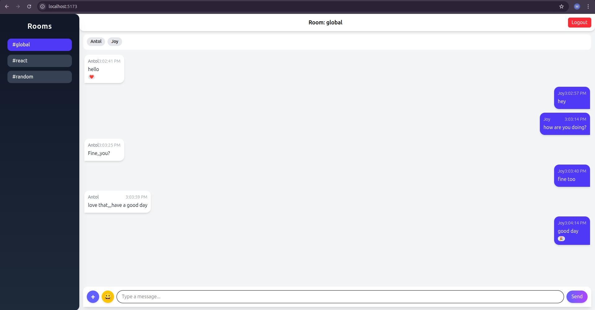
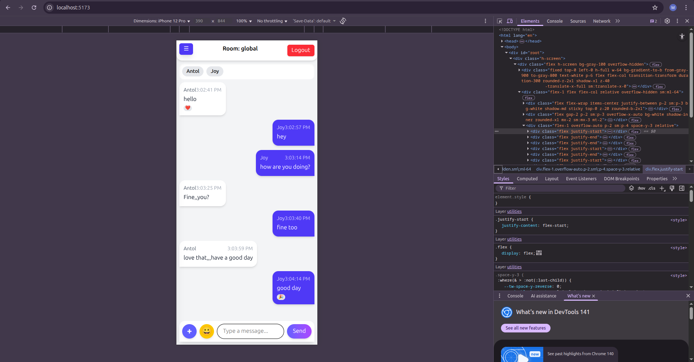

# React Socket.io Chat App

A real-time chat application built with **React**, **Socket.io**, and **Node.js**, supporting:

- Public and private messaging
- File uploads
- Message reactions (like 👍, ❤️, 😂, etc.)
- Typing indicators
- Online user list
- Responsive sidebar with hamburger menu
- Mobile-friendly layout
- Desktop-friendly layout with sidebar always visible
- Sound and browser notifications (optional)

---

## Screenshots

#### Desktop View


#### Mobile View


## Features

### Chat Features
- **Public Rooms**: Join predefined rooms like `global`, `react`, or `random`.
- **Private Messaging**: Send direct messages to online users.
- **Message Reactions**: Tap a message to add reactions.
- **File Uploads**: Upload images and files in chat.
- **Typing Indicators**: See who is typing in real time.
- **Unread Message Count**: Keep track of unread messages (can be added in future updates).
- **Sound & Browser Notifications**: Notify users when new messages arrive (optional).

### Responsive Design
- **Desktop**: Sidebar is always visible; chat area adjusted with `sm:ml-64`.
- **Mobile**: Sidebar slides in/out with a hamburger menu; overlay closes sidebar when clicked.

---

## Tech Stack

- **Frontend**: React, TailwindCSS
- **Backend**: Node.js, Express, Socket.io
- **Database**: MongoDB (for message storage and reactions)
- **File Upload**: Express + Multer (or your preferred solution)
- **Notifications**: Browser Notifications API (optional)
  
---

## Setup Instructions

### Prerequisites
- Node.js >= 18
- npm or yarn
- MongoDB running locally or via cloud (MongoDB Atlas)
  
### Backend Setup

1. Navigate to the backend folder:

```bash
cd server


2. INSTALL DEPENDENCIES
npm install

3. CREATE A .env FILE WITH,
PORT=4000
CLIENT_URL=http://localhost:5173
MONGO_URI=your_mongodb_connection_string
JWT_SECRET=your_jwt_secret


4. RUN THE BACKEND
npm run dev


FRONTEND SETUP
1. NAVIGATE TO THE FRONTEND FOLDER
cd client


2. INSTALL DEPENDENCIES
npm install


3. RUN FRONTEND
npm run dev
Open your browser at http://localhost:5173.


Socket.io INTEGRATION
The app connects to the backend via socket.io-client.
Real-time events include:
send_message
private_message
receive_message
add_reaction
reaction_updated
typing
typing_users
user_list


PROJECT STRUCTURE
project-root/
│
├─ client/             # React frontend
│  ├─ src/
│  │  ├─ components/
│  │  │  └─ Chat.jsx
│  │  ├─ context/
│  │  │  └─ AuthContext.jsx
│  │  └─ socket/
│  │     └─ socket.js
│  └─ package.json
│
├─ server/             # Express + Socket.io backend
│  ├─ controllers/
│  │  └─ chatController.js
│  ├─ models/
│  │  └─ Message.js
│  ├─ routes/
│  │  └─ chatRoutes.js
│  ├─ server.js
│  └─ package.json
│
└─ README.md


USAGE
1. Open the frontend in multiple browser tabs.
2. Join the same or different rooms.
3. Send messages, upload files, react to messages.
4. See typing indicators and online users in real time.
5. Toggle sidebar on mobile using the hamburger menu.


License
MIT © AntolTECHS